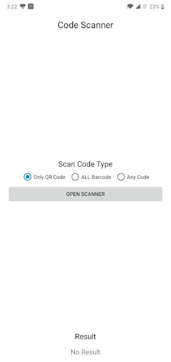
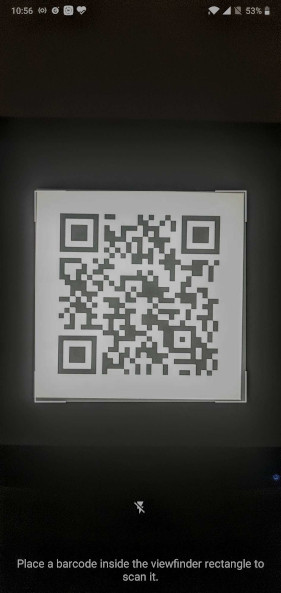

# CodeScanner - To Scan Different type of Codes

 

# Use Case
To scan multiple type of codes like qr code, barcode (1d,2d)

Download
--------

Grab via Maven:
```xml
<dependency>
  <groupId>com.hb.codescanner</groupId>
  <artifactId>codescanner</artifactId>
  <version>1.1</version>
  <type>pom</type>
</dependency>
```
or Gradle:
```groovy
implementation 'com.hb.codescanner:codescanner:1.1'
```

add root build.gradle > allProjects > repositories
```groovy
maven {
    url "https://dl.bintray.com/hbdevmdm/maven"
       }
```


# How it works?
**Build scanner config object and start activity**
  ```java
val codeScannerConfig = CodeScannerConfig
                    .Builder()
                    .setCodeType(CodeScannerConfig.CodeType.ALL_BARCODE) // CodeType.ALL_QR | CodeType.ALL | CodeType.ALL_BARCODE
                    .build()

startActivityForResult(CodeScannerActivity.createIntent(context..,codeScannerConfig), 111)
```

**and override onActivityResult on Activity/Fragment and write following**

```java
  override fun onActivityResult(requestCode: Int, resultCode: Int, data: Intent?) {
        super.onActivityResult(requestCode, resultCode, data)
         if(requestCode==111 && resultCode=Activity.RESULT_OK) {
              val scannerResult = data?.getParcelableExtra<ScannerResult>(CodeScannerActivity.RESULT_KEY)
              // Here you've scanned result
        }
    }
```

# Future Enhancement
- Scan from gallery


# License

```
Copyright 2017 HiddenBrains

Licensed under the Apache License, Version 2.0 (the "License");
you may not use this file except in compliance with the License.
You may obtain a copy of the License at

   http://www.apache.org/licenses/LICENSE-2.0

Unless required by applicable law or agreed to in writing, software
distributed under the License is distributed on an "AS IS" BASIS,
WITHOUT WARRANTIES OR CONDITIONS OF ANY KIND, either express or implied.
See the License for the specific language governing permissions and
limitations under the License.